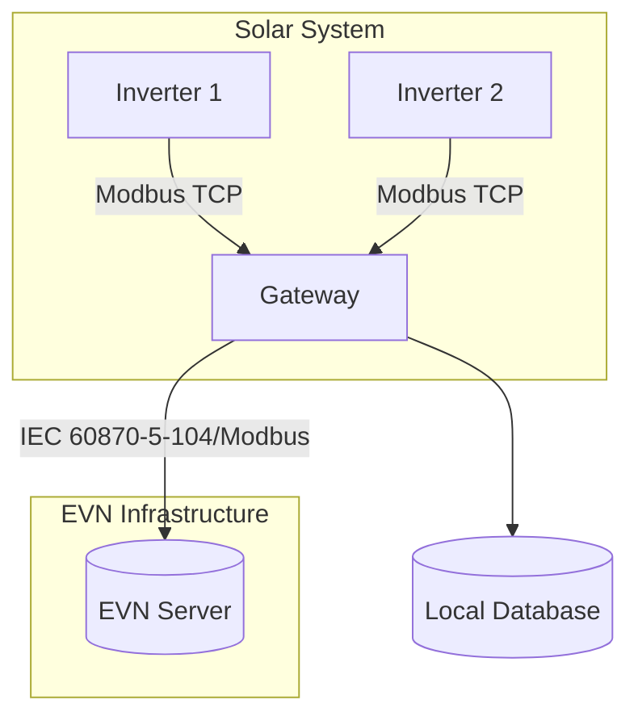
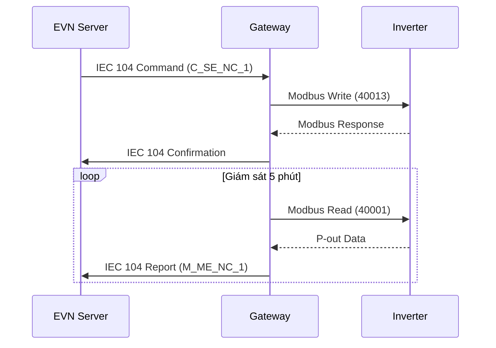

# GatRasGo 

Sơ đồ kết nối 
```markdown
# Solar Gateway System - EVN Integration

Gateway thu thập dữ liệu từ hệ thống điện mặt trời qua Modbus TCP và giao tiếp với EVN qua IEC 60870-5-104, viết bằng Golang.

## 📌 Hệ thống Architecture


## ✨ Tính năng chính
- 🔌 Đọc dữ liệu từ inverter qua Modbus TCP:
  - Công suất P-out/Q-out
  - Điện áp, dòng điện, tần số
- 📡 Giao tiếp 2 chiều với EVN qua IEC 104:
  - Nhận lệnh điều khiển SetPoint
  - Gửi dữ liệu giám sát thời gian thực
- 💾 Lưu trữ dữ liệu cục bộ (SQLite/PostgreSQL)
- 🔒 Hỗ trợ TLS cho kênh truyền EVN

## 📂 Cấu trúc Repository
```
solar-gateway/
├── cmd/
│   └── main.go         # Entry point
├── internal/
│   ├── modbus_inverter # Package giao tiếp inverter
│   └── iec104_evn      # Package giao tiếp EVN
├── configs/            # File cấu hình mẫu
│   ├── inverter.yml
│   └── evn.yml
└── docs/               # Tài liệu kỹ thuật
```

## 🛠 Cài đặt
### Yêu cầu hệ thống
- Go 1.16+
- Raspberry Pi OS (ARMv7+)
- Thư viện:
  ```bash
  go get github.com/goburrow/modbus
  go get github.com/simonvetter/iec104
  ```

### Bước triển khai
1. Clone repository:
   ```bash
   git clone https://github.com/your-repo/solar-gateway.git
   cd solar-gateway
   ```
2. Cài đặt dependencies:
   ```bash
   go mod tidy
   ```
3. Cấu hình:
   ```bash
   cp configs/inverter.example.yml configs/inverter.yml
   cp configs/evn.example.yml configs/evn.yml
   ```
4. Build cho Raspberry Pi:
   ```bash
   GOOS=linux GOARCH=arm GOARM=7 go build -o gateway ./cmd/main.go
   ```

## ⚙ Cấu hình hệ thống
### File `configs/inverter.yml`
```yaml
devices:
  - ip: "192.168.1.100"
    port: 502
    slave_id: 1
    registers:
      p_out: 40001
      setpoint: 40013
    timeout: 10s
```

### File `configs/evn.yml`
```yaml
server:
  port: 2404
  link_address: 1
  asdu_address: 1000
security:
  tls_enabled: false
  cert_path: "/path/to/cert.pem"
```

## 📡 Sơ đồ giao tiếp



## 📊 Bảng địa chỉ Modbus
| Thông số        | Địa chỉ | Kiểu dữ liệu |
|-----------------|---------|--------------|
| P-out (kW)      | 40001   | Float32      |
| SetPoint (%)    | 40013   | Float32      |
| Điện áp pha A   | 40005   | Float32      |
| Dòng điện pha A | 40011   | Float32      |

## 🔒 Bảo mật
- Mã hóa TLS cho kênh IEC 104
- Xác thực certificate 2 chiều
- IP Whitelisting cho cổng Modbus
- Logging với audit trail

## 📚 Tài liệu tham khảo
- [Modbus Specification](https://modbus.org/specs.php)
- [IEC 60870-5-104 Standard](https://webstore.iec.ch/publication/4552)
- [EVN Technical Requirements](https://www.evn.com.vn/)

## 📄 Giấy phép
MIT License - Xem file [LICENSE](LICENSE)

---
